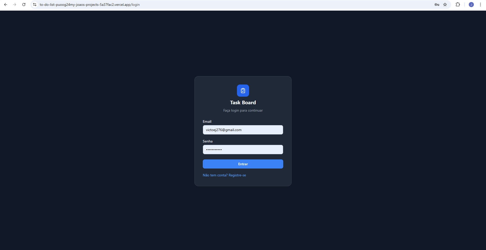

📝 ToDo Fullstack – Gestão Eficiente com Drag & Drop
Esta é uma aplicação de gerenciamento de tarefas completa, focada em experiência do usuário (UX) e performance. O projeto conta com autenticação segura, persistência em banco de dados relacional e uma interface intuitiva com suporte a arrastar e soltar (Drag & Drop) e salvamento de preferências de tema.

🔗 Links Úteis
Live Demo: https://to-do-list-one-tau-59.vercel.app/

🚀 Principais Funcionalidades
Autenticação JWT: Sistema de login seguro com proteção de rotas.

Kanban interativo: Organize tarefas entre colunas (Pendente, Fazendo, Feito) usando react-beautiful-dnd.

Persistência de Tema: Escolha entre Dark e Light mode, com a preferência salva diretamente no seu perfil (Banco de Dados).

Gestão de Tarefas (CRUD): Criação, edição, exclusão e reordenação com persistência no Neon (PostgreSQL).

Arquitetura Monorepo: Organização clara entre Front-end e Back-end no mesmo repositório.

🛠️ Tecnologias Utilizadas
Front-end
React + TypeScript: Interface reativa e tipagem forte.

Tailwind CSS: Estilização moderna e responsiva.

Axios: Consumo de API com interceptors para tokens de segurança.

Vite: Ferramenta de build de alta performance.

Back-end
Fastify: Framework Node.js focado em baixo overhead e velocidade.

Neon (PostgreSQL): Banco de dados serverless de última geração.

Zod: Validação de esquemas e dados rigorosa.

Fastify JWT: Implementação de tokens de autenticação.

📐 Arquitetura do Projeto
O projeto segue uma estrutura de Monorepo:

Plaintext
├── BACKEND/         # API Fastify, Schema do banco e rotas
├── FRONTEND/        # Aplicação React, Componentes e Serviços
└── .gitignore       # Configuração global de segurança
⚙️ Como rodar o projeto localmente
Clone o repositório:

Bash
git clone https://github.com/JoaoVictorMatos/ToDo_List.git
Configuração do Banco:

Crie uma instância no Neon.tech.

Crie as tabelas usando o script BACKEND/create-tables.js.

Instalação de Dependências:

Entre em BACKEND e rode npm install.

Entre em FRONTEND e rode npm install.

Variáveis de Ambiente:

Crie um arquivo .env em BACKEND com sua DATABASE_URL e SECRET.

Execução:

No Backend: npm start

No Frontend: npm run dev

👤 Autor
João Victor Vieira Neto Matos

Estudante de Sistemas de Informação na UFLA.

Focado em Automaçãoe Desenvolvimento Fullstack.

[LinkedIn](www.linkedin.com/in/joaomatos02)